<h1 align="center">⛏️ MineRust</h1>

<p align="center"><b>A Minecraft-style survival sandbox written from scratch in Rust — every texture, sound, mesh, and menu generated from code. Zero asset files.</b></p>

<p align="center">
  <i>~14,600 lines of Rust · one rendering dependency (<a href="https://github.com/not-fl3/macroquad">macroquad</a>) · 24 unit tests · 95+ fps</i>
</p>

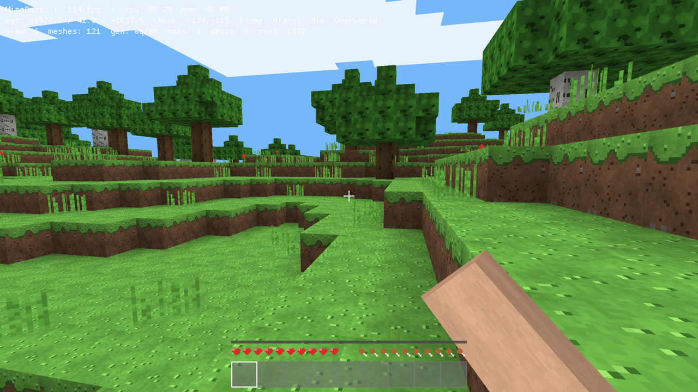

---

## Gallery

| | |
|:---:|:---:|
| 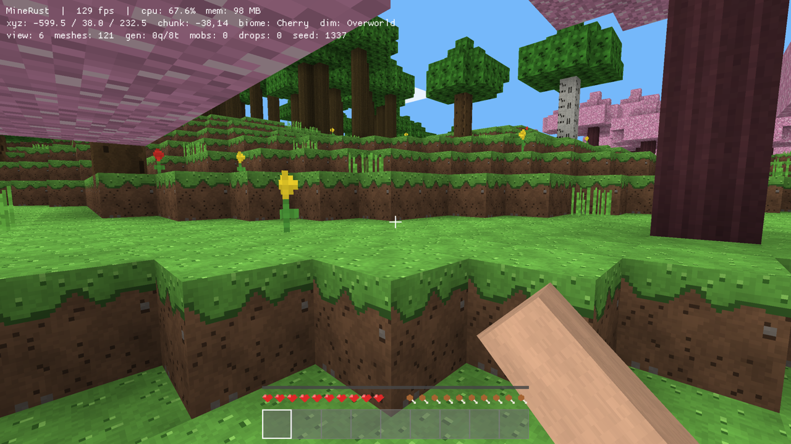 | 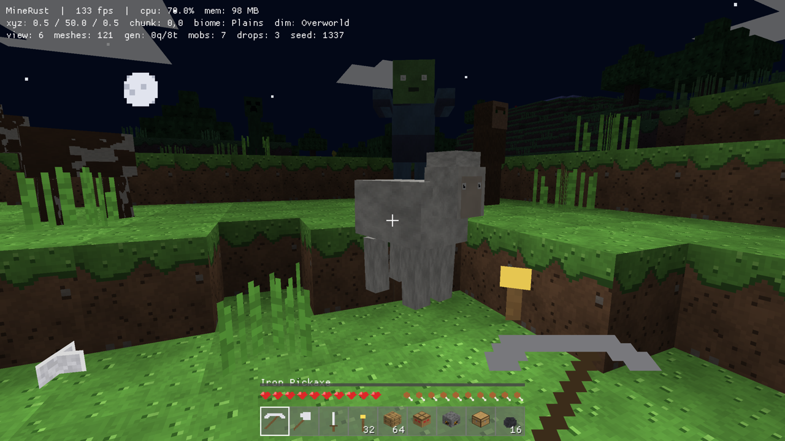 |
| *Cherry groves at the edge of the plains* | *Flood-fill torchlight holding back the night* |
| 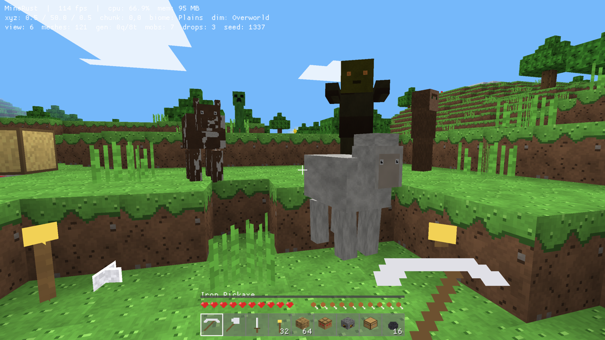 | 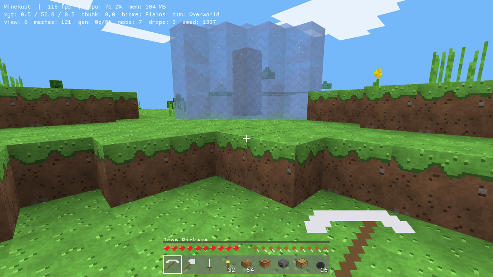 |
| *Pigs, cows, sheep, zombies, creepers — sun-shaded, limb-animated* | *Flowing water cascading over a ledge* |
| 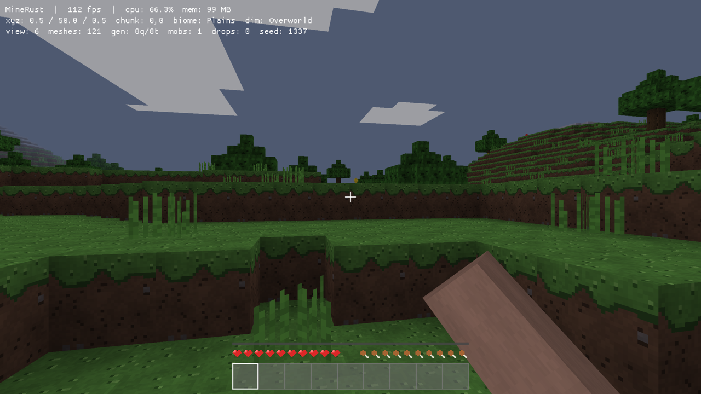 | 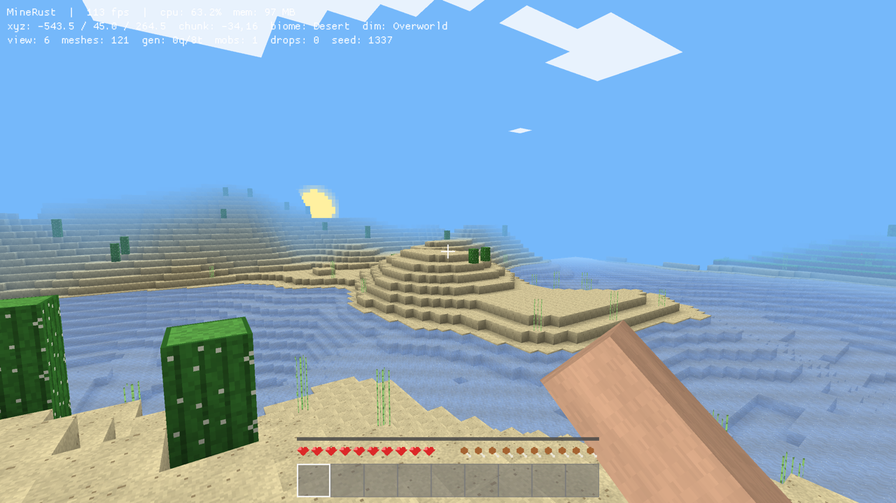 |
| *Sunset fading into a starry night* | *Desert biome with cacti* |
| 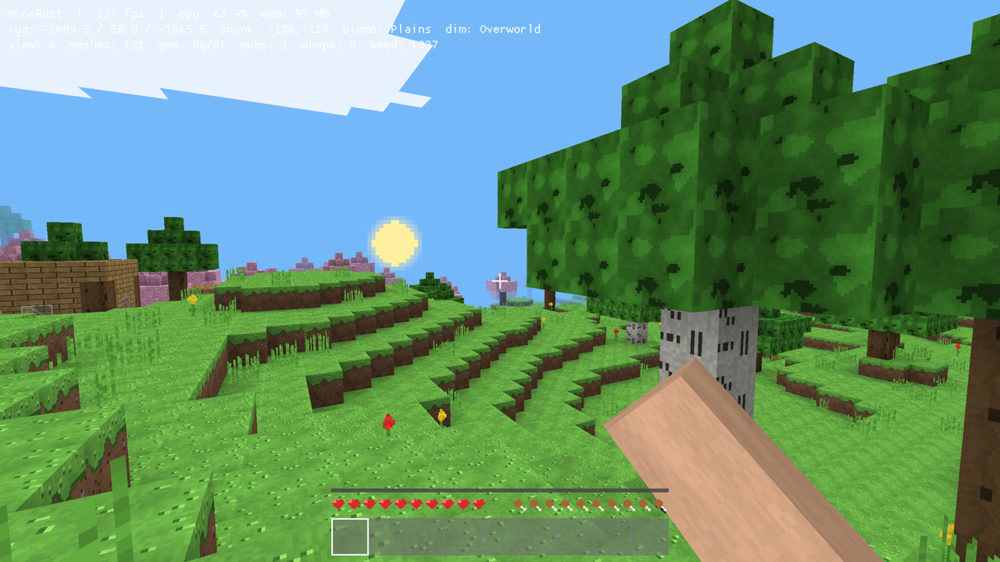 | 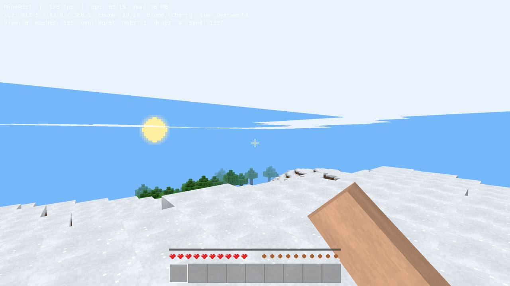 |
| *A village house on the plains* | *Snow above the treeline* |
| 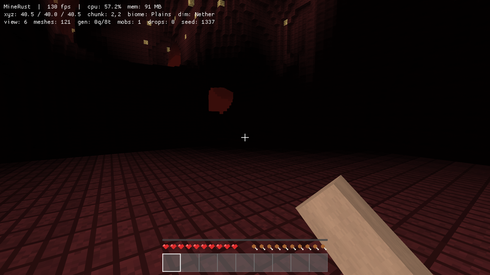 | 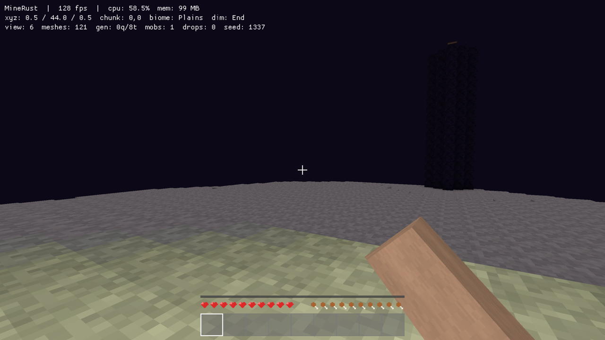 |
| *The Nether: fortresses over lava oceans* | *The End: the dragon's island over the void* |
| 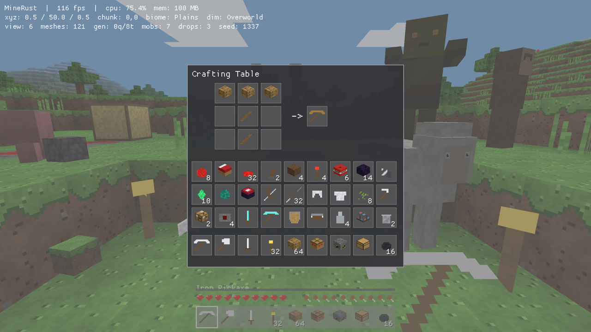 | 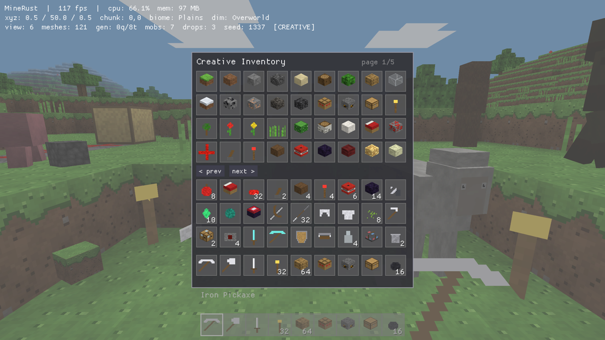 |
| *3×3 crafting with isometric 3D item icons* | *The creative inventory* |
| 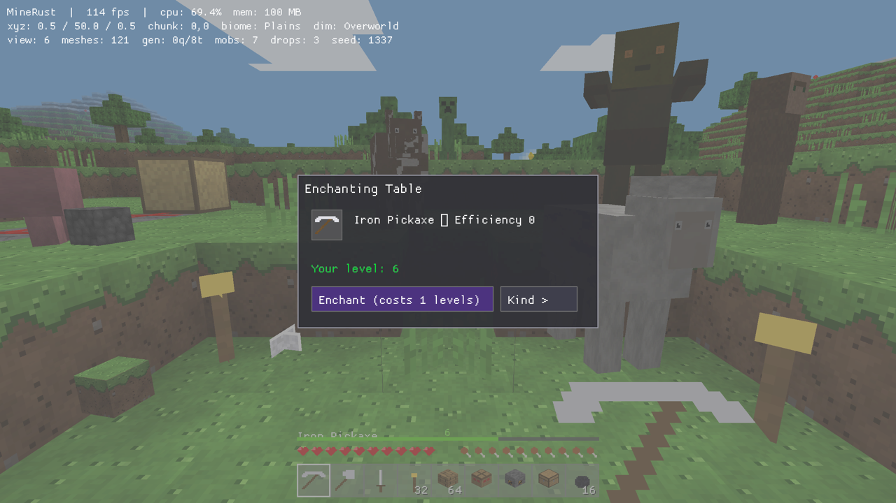 | 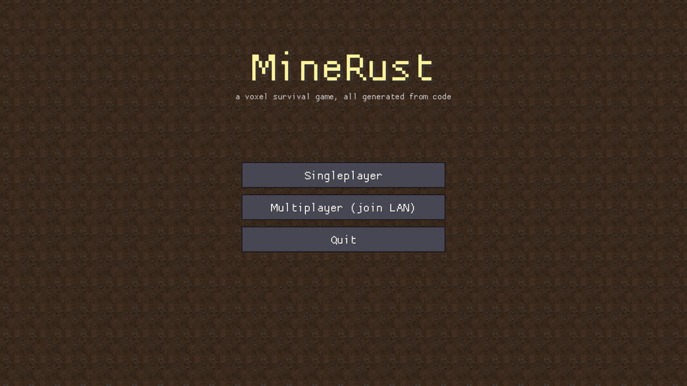 |
| *Twelve enchantments across five levels* | *The title screen* |

## What is this?

A from-scratch homage to Minecraft built as a single Rust binary. There are no
PNGs, no WAVs, no model files in this repository — the 256-tile texture atlas
is painted pixel-by-pixel from hash noise at startup, the sounds are
synthesized sample-by-sample, the mobs are assembled from shaded boxes, and
the worlds stream out of layered value noise. The full survival loop works:
**mine → craft → smelt → build → farm → fight → brew → enchant → cross
dimensions → kill the dragon.**

## Quick start

```sh
cargo run --release
```

Pick **Singleplayer → Create New World**, name it, choose Survival or
Creative, and you're in. Your first day, the classic way:

1. **Punch a tree** (hold left-click) and craft planks → sticks → a crafting
   table (press `E`).
2. Make a **wooden pickaxe**, mine stone, upgrade to **stone tools**.
3. Mine **coal**, craft **torches** — night is genuinely dark and zombies,
   skeletons, spiders, and creepers come out.
4. Smelt **iron** in a furnace, then armor, a shield, a bucket — a full
   progression all the way to **diamond** and **enchanted gear**.
5. Light a portal, raid a **nether fortress**, barter with **piglins**,
   craft an **End portal**, and take down the **Ender Dragon**.

## Features

### World
- Infinite terrain streamed in chunks, generated on a **multithreaded worker
  pool** — plains, forests, deserts, jungles, cherry groves, tundra, oceans,
  beaches, snow-capped mountains
- Cheese **and** spaghetti caves; coal, iron, copper, redstone, gold,
  diamond, and amethyst ores layered by depth; deepslate; the **Warden**
  guarding the deepest dark
- **Structures**: villages, dungeons with monster spawners, desert pyramids,
  shipwrecks, ocean ruins, woodland mansions, nether fortresses, bastion
  remnants, End towers, ancient cities crusted in sculk
- **Liquid dynamics** — water and lava flow, spread, cascade, and evaporate
- **Block gravity** — sand and gravel fall as animated entities; plants,
  torches, and redstone pop without support
- Day/night cycle with **sunrise and sunset skies**, drifting clouds, stars,
  sun and moon; periodic **rain**
- Full **persistence**: named world saves, each with its own seed and game
  mode

### Rendering & feel
- **High-resolution 32×32 procedural textures** for the core terrain set —
  rounded cobbles, wavy wood grain, ring-grained logs, glinting water
- **Flood-fill lighting** (block light + skylight) — caves are dark until you
  bring torches; **vertex ambient occlusion**; **distance fog**; shimmering
  water
- **GPU-resident chunk meshes** drawn with raw pipeline calls (+32% fps over
  streamed batching) on top of the threaded chunk generation
- First-person **arm and held-item view model** with chopping swing, walk
  sway, head bob, sprint FOV kick; **F5 third person** with a full player
  model
- Mobs with **pivot-articulated limbs**, sun-direction face shading,
  anatomical details (snouts, horns, combs, wagging tails), and 32×32 skins
  with pupil-and-catchlight eyes
- Block-break **particles**, potion shimmer, footstep sounds voiced by the
  ground material, synthesized dig/place/hurt/boom audio

### Survival
- Mining with per-block hardness, tool classes and five tiers (wood → stone
  → iron → gold → diamond), eight-stage crack animation, item durability
- 36-slot inventory + armor slots, **2×2 and 3×3 crafting** (~50 shaped
  recipes), furnaces plus **smokers and blast furnaces**, chests, **anvils,
  grindstones, smithing tables, composters**
- Health, hunger and saturation, drowning, fall damage, cactus and lava
  damage, death and respawn, beds that skip the night and set spawn
- **Farming** (hoe → farmland → wheat → bread, bonemeal), **fishing**, food
  cooking
- **Brewing** (Healing, Swiftness, Strength, Regeneration with timed
  effects), golden apples
- **Twelve enchantments** across five levels — Efficiency, Unbreaking,
  Mending, Sharpness, Knockback, Looting, Power, Punch, Protection, Thorns,
  and two curses — applied at the table or via **enchanted books**
- **XP** from mining and combat; shields, bows, crossbows, tipped and
  spectral arrows

### Redstone
- Wires with 15 signal levels, levers, redstone torches, **repeaters**,
  **comparators** (read container fill), lamps that emit real light,
  **observers**, **sculk sensors**, **dispensers** that shoot arrows,
  **hoppers**, and **TNT** with chain reactions and real craters

### Mobs
- Passive: pigs, cows, sheep, chickens, **tameable wolves** (bones), and
  villagers / wandering traders with **emerald trading**
- Hostile: zombies (burn at dawn), desert husks, skeleton archers, spiders,
  **creepers** that blow real holes, the **Warden**, and the **Ender
  Dragon** — kill it for the win screen and an elytra glide home
- Nether: piglins that **barter for gold**, striders pacing the lava

### Dimensions
- **The Nether** via obsidian portals: netherrack caverns, lava oceans,
  glowstone, crimson forests, fortresses, bastions
- **The End** via End portals: the void island, obsidian towers with
  **elytra** loot, and the dragon

### Multiplayer
- **LAN multiplayer from the pause menu** — host with one click, friends
  join by address; multiple clients, relayed block edits and positions,
  **host-authoritative mobs and shared drops**, routed damage, and **chat**
  (`T`)
- **Minecraft-protocol compatible server list ping** — MineRust hosts on
  25565 and speaks the real Minecraft Java Edition wire protocol alongside
  its own, so a **stock Minecraft client of any version** can add the server
  and see it in the Multiplayer list with a live MOTD, version, and player
  count. Modern *and* legacy (pre-1.7) pings are answered; a login attempt
  gets a clean, localized disconnect message. Run it headless with no window
  via `MINERUST_MC_SERVER=1 cargo run`. (Full Play-state join — chunk
  streaming so a vanilla client can walk around — is the next step; the
  VarInt/packet codec it needs already lives in `mcproto.rs`.)

### Creative mode
- Per-world game mode (or `/gamemode c|s` live): instant breaking, infinite
  items, invulnerability, double-tap-space flight, and a paged **creative
  inventory** of every block and item

## Controls

| Key | Action |
|-----|--------|
| WASD / Mouse | Move / look |
| Hold Left click | Mine block / attack |
| Right click | Place / use / eat / shield |
| `E` | Inventory & crafting (creative picker in creative) |
| 1–9 / scroll | Hotbar |
| Space | Jump / swim / climb — double-tap to fly (creative) |
| Left Shift | Sprint (sprint-swim in water) |
| `T` | Chat & `/gamemode` commands |
| `F` | Fly (debug) · `F3` debug overlay (fps, CPU, memory) · `F5` third person |
| `[` / `]` | View distance |
| Esc | Pause menu (save / host / join / quit) |

## For tinkerers

```
src/
├── main.rs      game loop, menus, net pump, interactions, render passes
├── world.rs     noise, biomes, structures, fluids, redstone power, gen pool
├── mesher.rs    chunk meshing, flood-fill lighting, ambient occlusion
├── gpu.rs       GPU-resident chunk buffers and raw draw pipeline
├── entities.rs  mob AI, articulated models, item drops
├── items.rs     items, ~50 recipes, inventory, furnace/enchant logic
├── ui.rs        every screen and HUD widget
├── blocks.rs    89 block types and their physics/render properties
├── textures.rs  the entire texture atlas, painted from code
├── player.rs    AABB physics, survival stats, movement
├── net.rs       LAN protocol (host/client, snapshots, relay)
├── mcproto.rs   Minecraft Java protocol: server-list ping, status, login
├── sound.rs     WAV synthesis
└── save.rs      binary world format (v5)
```

Useful environment variables for scripting and screenshots:

| Variable | Effect |
|----------|--------|
| `MINERUST_SEED` / `MINERUST_POS=x,z` / `MINERUST_TIME=0..1` / `MINERUST_LOOK=yaw,pitch` | Stage the world |
| `MINERUST_DIM=1\|2` | Start in the Nether / End |
| `MINERUST_DEMO=1` | Mob lineup, gear, torches, a redstone circuit, a waterfall |
| `MINERUST_CREATIVE=1` / `MINERUST_VIEW=n` / `MINERUST_NOSAVE=1` | Mode, view distance, no save file |
| `MINERUST_HOST=1` / `MINERUST_JOIN=ip` | Multiplayer |
| `MINERUST_MC_SERVER=1` | Headless Minecraft-protocol server-list endpoint (no window) |
| `MINERUST_SHOT=1` / `MINERUST_UI=...` / `MINERUST_MENUSHOT=...` | Screenshot automation |

Tests cover terrain determinism (including the threaded generator), fluids,
gravity, recipes, smelting, drops, enchant data, explosions, villages, tree
generation, the network codec, the Minecraft protocol codec (VarInt encodings,
status/ping/login round-trips against an in-process client), and save
round-trips: `cargo test --release`.

## Scope

Everything here is a working, scoped re-creation of its Minecraft
counterpart, built for the joy of the loop rather than 1:1 parity. The
defining systems are all present and playable end-to-end; the long tail of
modern Minecraft content (more biome variants, villager professions, raids,
banners, books-and-quills…) is left as an exercise for the next thousand
lines.
